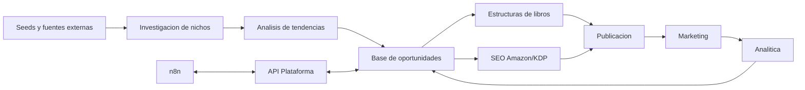

# Arquitectura

## Principio rector

La editorial se modela como una plataforma operativa. Cada modulo resuelve una
capacidad del negocio y se comunica con el resto mediante modelos y puertos
estables. El pipeline principal solo orquesta.

## Capas

- `core`: modelos, contratos, scoring, almacenamiento y orquestacion.
- `modules`: capacidades de negocio independientes.
- `integrations`: catalogo y adaptadores para APIs externas.
- `automations`: conectores y workflows n8n.
- `api`: superficie HTTP opcional para automatizaciones y dashboards.
- `docs`: decisiones tecnicas y operativas.

## Decision tecnica inicial

Python es la base porque permite integrar IA, datos, analitica y APIs con baja
friccion. SQLite es suficiente para el MVP porque reduce operaciones y permite
que n8n y la CLI compartan estado local. Cuando haya varios usuarios, colas o
jobs concurrentes, la migracion natural es PostgreSQL mas una cola de trabajos.

## Contratos de modulo

Cada modulo debe:

- Exponer un `Service` de dominio.
- Recibir datos por modelos tipados de `core.models`.
- No depender directamente de n8n, FastAPI ni proveedores externos.
- Usar puertos/adaptadores cuando necesite APIs.
- Producir salidas serializables para auditoria y automatizacion.

## Flujo MVP

1. Entrar seeds de nicho.
2. Crear senales de demanda y momentum.
3. Generar snapshot de mercado.
4. Calcular score de oportunidad.
5. Persistir oportunidad.
6. Crear estructura, SEO pack y plan de marketing.
7. Exportar JSON o exponer resultado por API.

